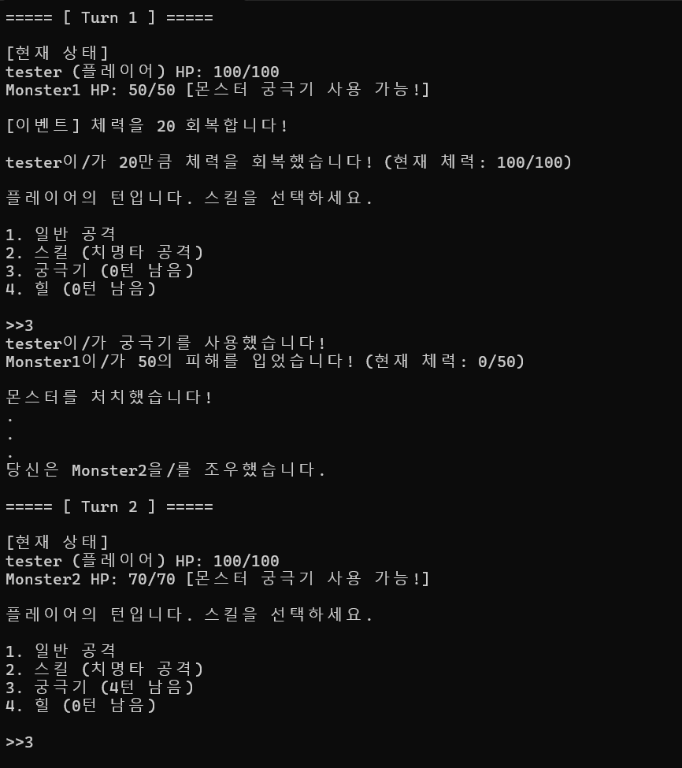

# YUTURN
텍스트 기반 콘솔 턴제 게임입니다. 플레이어는 턴제 전투를 통해 몬스터를 물리치고, 다양한 스킬과 이벤트를 활용해 최대한 오래 생존하여야 합니다.

## 주요 기능
- 턴제 전투 시스템
- 궁극기, 힐 등 다양한 스킬
- 랜덤 이벤트 발생
- 랭킹 저장 및 출력 기능

## 설치 및 실행 방법
### Release파일로 실행하기
1. Release 항목의 .exe파일을 다운로드 합니다.
2. 다운한 .exe파일을 실행합니다.

### 클론으로 실행하기
1. 프로젝트를 클론합니다.
2. C++ 컴파일러로 컴파일합니다.
3. 실행합니다. 

## 개발자
- 김수빈
- 권가연
- 이준민
